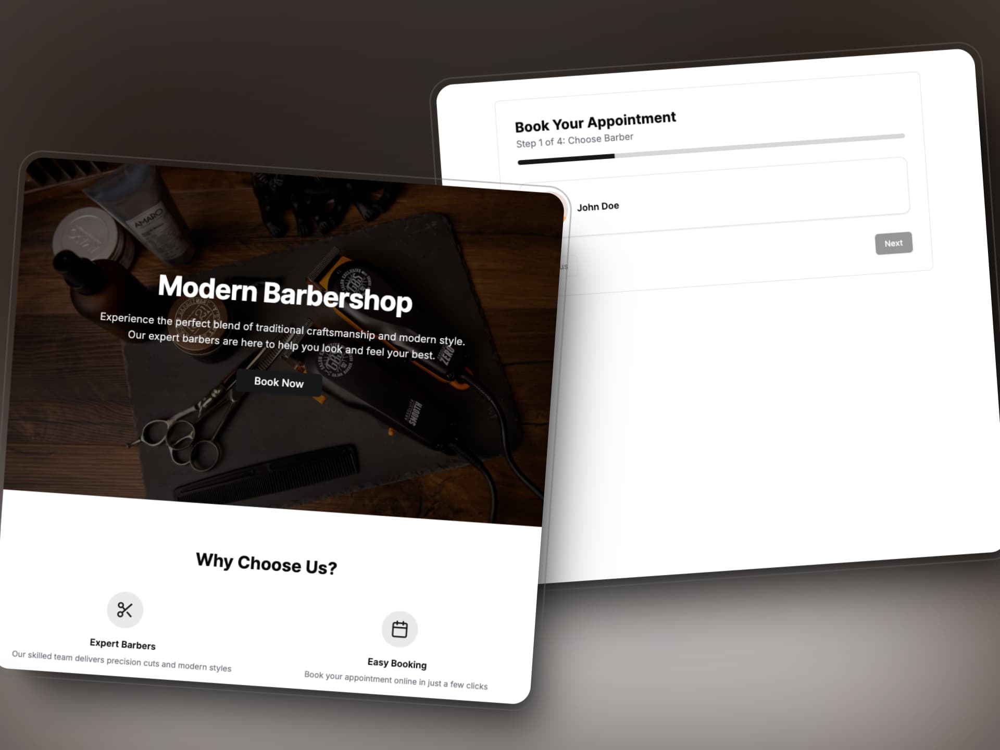

# Barbershop Management Application



**Live Demo:** [Barbershop App](https://barbershop.facupm.dev/)

> _Disclaimer: This is a real-world project developed for a customer._

The Barbershop Management Application is a comprehensive fullstack solution designed to streamline the operations of a modern barbershop. This project showcases the integration of frontend and backend technologies within a monorepo setup, ensuring a seamless development and deployment process.

## Project Description

The goal of this project is to create a robust application that allows barbershop owners to manage their team, schedule appointments, and handle customer bookings efficiently. By leveraging a monorepo structure, we maintain cohesive and scalable codebases for both the frontend and backend, facilitating easier maintenance and feature expansions.

## Features

- **Employee Management:** Add, edit, and delete barbers with detailed profiles.
- **Scheduling:** View and manage weekly schedules, including available time slots.
- **Appointment Booking:** Customers can book appointments online with real-time availability.
- **Real-Time Updates:** Utilize React Query for efficient data fetching and caching.
- **Responsive Design:** Ensure a seamless experience across all devices.
- **Notifications:** Automated confirmations and reminders for appointments.

## Tools Used

- **React.js:** For building a dynamic and responsive user interface.
- **Next.js 15:** Modern framework for server-side rendering and routing.
- **Tanstack Query:** For efficient data fetching, caching, and state management.
- **Drizzle ORM:** Type-safe ORM for database interactions.
- **Zod:** Schema validation for robust data handling.
- **Date-FNS:** Utility library for date manipulation.
- **Lucide-React:** Icon library for enhancing UI elements.
- **Sonner:** Notification library for user feedback.

## Technical Hurdles

### Dynamic Employee Management

One of the significant challenges was implementing a dynamic employee management system. Ensuring that adding, editing, and deleting employees would reflect seamlessly across the application required meticulous state management and API design. Utilizing Drizzle ORM and React Query facilitated a type-safe and efficient approach to handle these operations.

### Scheduling with Time Slot Management

Creating a flexible scheduling system that accommodates multiple employees and their available time slots was complex. Implementing CRUD operations for time slots and ensuring real-time availability required careful planning and robust backend logic.

## Installation

1. **Clone the Repository:**
   ```bash
   git clone https://github.com/facuperezm/barbershop.git
   ```
2. **Navigate to the Project Directory:**
   ```bash
   cd barbershop-app
   ```
3. **Install Dependencies:**
   ```bash
   pnpm i
   ```
4. **Set Up Environment Variables:**
   Create a `.env` file in the root directory and add necessary environment variables as per the `.env.example` file.
5. **Run the Development Server:**
   ```bash
   pnpm dev
   ```

## Contact

- **Facundo Perez Montalvo**
- [Portfolio](https://facuperezm.com)
- [LinkedIn](https://www.linkedin.com/in/facuperezm/)
- [GitHub](https://github.com/facuperezm)

[](https://facuperezm.com)
[](https://www.linkedin.com/in/facuperezm/)
[](https://github.com/facuperezm)
